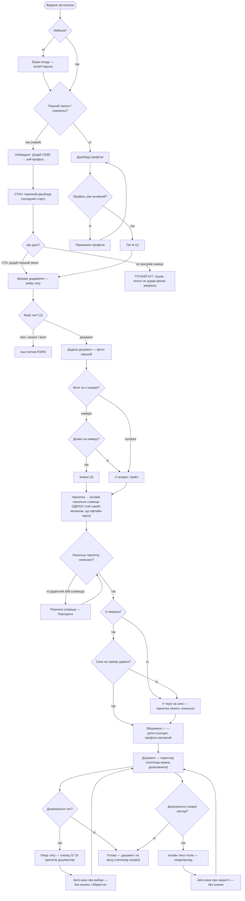
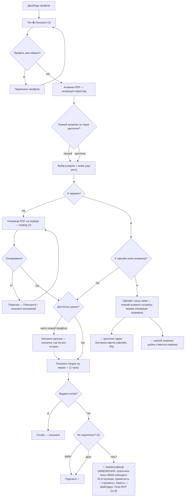
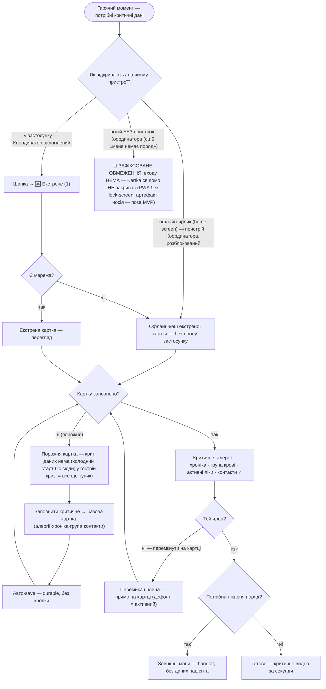
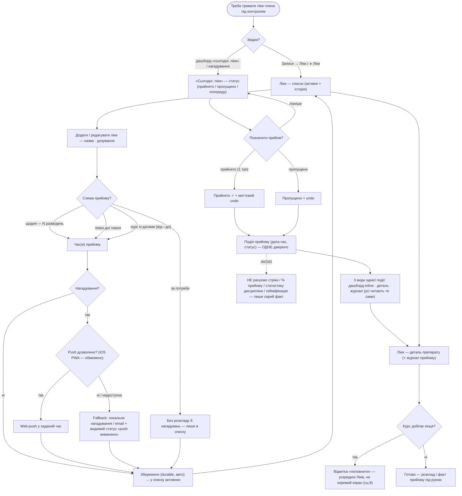
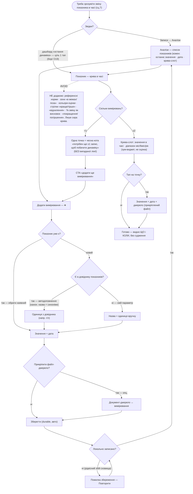
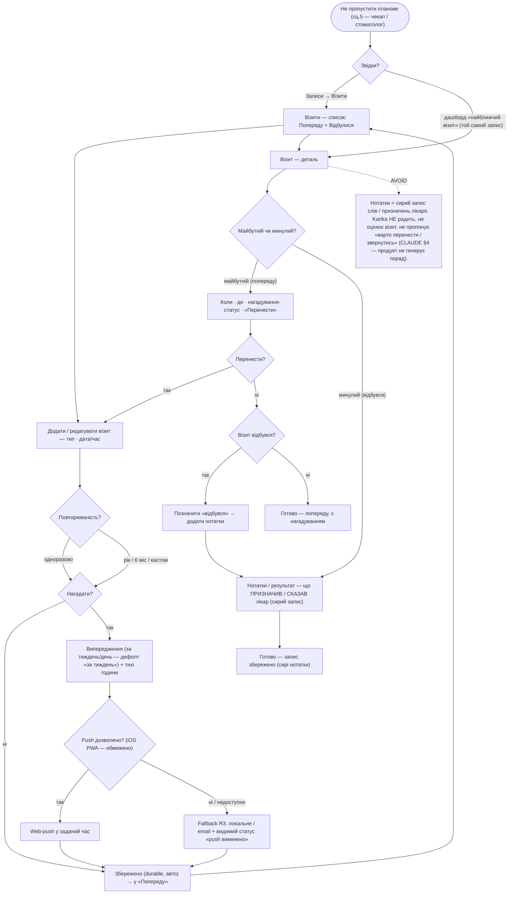

# User flows — Kartka

Наскрізні потоки для **ядра MVP** (jobs із [`research/jtbd.md`](research/jtbd.md)).
Вузли `[у дужках]` — екрани зі [`sitemap.md`](sitemap.md) («Екрани»); ромби
`{питання?}` — точки рішень; стани (холодний старт / офлайн / error) — окремими
вузлами. **Межа:** жоден вузол не інтерпретує дані (норм/зон/оцінок немає — AVOID).

---

## R1 — ДОДАТИ документ  *(ризик №1, ціль ≤3 тапи · primary: Координатор)*

**Рішення:** `Увійшов?` · `Перший запуск/порожньо?` (холодний старт) · `Профіль
уже активний?` (інакше — перемикач) · `Який тип?` (глобальний «+») · `Фото чи з
галереї?` · `Дозвіл на камеру?` · `Локальну чернетку записано?` · `Є мережа?` ·
`Синк удався?` · `Дозаповнити тип?` · `Дозаповнити лікаря/заклад?`.
**Стани:** холодний старт (порожній дашборд + CTA); **durable-чернетка одразу
після знімка** (той самий механізм, що офлайн-черга) → синк фоном; локальне
збереження офлайн (черга синку); рідкісний збій сховища (повтор).
**Щасливий шлях ≤3 тапи:** `➕ (1) → Документ (2) → Знімок (3)` → збережено
(дата/профіль авто; знімок одразу йде в durable-чернетку, синк — фоном).
**Тупики:** новий користувач не зрозумів навіщо → пішов (adoption-ризик — **досі
відкрито**, IA-борг).
**Закрито (було тупиком):** «вийшов під час помилки → знімок втрачено» більше
**не** тупик — знімок одразу в durable-чернетці, синк-помилка лише відкладає
докоміт у фон; лишається тільки рідкісний збій *локального* сховища (показуємо
помилку, не тиха втрата).
**Дозаповнити метадані (опційний під-потік — додано, щоб замкнути R1):** з перегляду
можна дозаповнити **тип** (пікер-overlay §7 — 6 пресетів, CLAUDE фіча 2) і
**лікар/заклад** (інлайн текст). **Авто-save** при виборі/закритті, **без ручної
кнопки «Зберегти»** — той самий durable-принцип, що й у захопленні. «Ні» → лишається
«не вказано» (поля опційні). Не подовжує щасливий шлях ≤3 тапи (метадані — вже після
збереження документа). Раніше було двома тупиками `#` на перегляді.

---

## R2 — ПОКАЗАТИ анамнез лікарю  *(момент цінності · primary)*

**Рішення:** `Профіль уже обрано?` · `Повний чи лише критичне?` · `Є мережа?`
(офлайн → кеш) · `Згенеровано?` · `Достатньо даних?` · `Як поділитися?`.
**Стани:** loading (серверна генерація), помилка генерації (повтор/кеш), офлайн
(кешований анамнез — jtbd сц.2), неповна картина (чесна позначка, **не** оцінка).
**Щасливий шлях:** `📤 Показати (1) → Згенерувати (2)` → показ на екрані = **2
тапи**; `+ Поділитися (3)` = віддати файл.
**Тупики:** офлайн **і** немає офлайн-копії (ще жодного разу не генерували) →
повний анамнез потребує мережі. **НЕ глухий кут** (`offlim`): вихід — критичне
доступне офлайн через **Екстрену картку (R5)**; повний анамнез — щойно з'явиться
мережа. Дзеркалить R5-`deadempty` (тупик дістає вихід).
**Шер (рішення «б» — приватність):** лише **файл + друк**. **Публічний лінк —
свідомо НЕ робимо** (єдине місце, де дані жили б поза RLS-ізоляцією; суперечить
стрижню продукту). Сц.8 «надіслати лінк» → **зафіксоване обмеження** (`nolink`):
PDF-файл вкладенням замість лінка, не діра.

---

## R5 — ЕКСТРЕНА картка  *(гарячий момент · офлайн обов'язково · на присутньому розблокованому пристрої Координатора)*

**Рішення:** `Як відкривають / на чиєму пристрої?` (офлайн-ярлик / у застосунку /
**носій без пристрою Координатора → зафіксоване обмеження, поза скоупом**) · `Є
мережа?` (офлайн → кеш) · `Картку заповнено?` · `Той член?` (перемикач на картці) ·
`Потрібна лікарня поряд?`.
**Стани:** **офлайн-кеш** (service worker, без повного входу — CLAUDE §6) —
обов'язкова гілка; порожня картка (холодний старт). Кеш містить картки всіх членів;
**вибір члена — перемикач ПРЯМО на картці** (дефолт = активний профіль, не окремий
крок) — раніше IA-борг, тепер закрито.
**Щасливий шлях:** `🆘 / офлайн-ярлик (1)` → критичне видно за **1 тап**, офлайн
(на присутньому розблокованому пристрої Координатора).
**Тупики:** базову картку не заповнено → у **гострій** кризі нема що показати
(найдорожчий тупик). **Вихід (проактивний):** порожня картка веде **«заповнити
критичне» → базова картка** (спільний екран `edit-base-card`; auto-save). *Нюанс:*
заповнення = **профілактика** (щоб наступного разу було) — саму гостру кризу не
рятує; тому критичне женемо внести **ДО** кризи (тому й `dashboard-empty` так само
проактивний). Той самий екран закриває й тупик `dashboard-empty`.
**Handoff:** «Лікарня/травмпункт поряд» → зовнішні мапи ОС, без передачі даних
пацієнта (не екран, не каталог).

**✅ РІШЕНО (P0, варіант «а» — обіцянку R5 звужено):** обидва входи вище
(офлайн-ярлик і 🆘 у застосунку) фізично живуть на **пристрої Координатора**. Тому
**обіцянка R5 = «швидкий доступ до критичного на ПРИСУТНЬОМУ РОЗБЛОКОВАНОМУ
пристрої Координатора»** — без «коли мене немає поряд» для самого Носія.
**Зафіксоване обмеження (не відкрите питання):** шлях «носій без пристрою
Координатора» Kartka **свідомо НЕ закриває** — PWA не дає lock-screen (CLAUDE §6);
фізичний артефакт носія (друкований QR / картка алергій при дитині/літньому) —
**поза скоупом MVP** (можливе майбутнє, не тепер). «Без повного входу» обходить
логін *застосунку*, **не** блокування *пристрою* — і це прийнято свідомо.
→ У трасуванні сц.6 покрито **частково** (на присутньому пристрої), не повним ✓.

---

## R3 — ТРИМАТИ ЛІКИ під контролем  *(щоденний прийом, сц.1 — найчастіша дія продукту)*

**Рішення:** `Звідки?` · `Схема прийому?` (розклад) · `Нагадування?` · `Push дозволено?` ·
`Позначити прийом?` · `Курс добігає кінця?`.
**Екрани (усі в sitemap):** `Ліки — список` · `Додати / редагувати ліки` (розклад +
нагадування — under-flow усередині) · `Ліки — деталь препарату (+ журнал прийому)`. Не
окремі екрани: «сьогодні: ліки» (кластер Дашборда + статус у деталі), «поповнити»
(усередині Ліків), розклад/нагадування-конфіг (у Додати/ред.).
**Стани:** порожній список (нема ліків — R3 **опційний**, це норма, не тупик); завантаження
/ помилка списку (сервер); журнал порожній (ще нема прийомів); durable-save; fallback
нагадувань (push недоступний).
**Щасливий шлях (сц.1 — найчастіша дія продукту):** дашборд «сьогодні: ліки» → **«Прийнято»
(1 тап) + миттєвий undo**. Позначка = **одна подія**, видима в 3 місцях.
**Обмеження (не тупики):** push недоступний (iOS PWA) → **fallback** (локальне/email +
видимий статус); «за потреби» → свідомо без нагадувань.
**Зв'язок (закриває IA-борг R3):** прийом — **одна подія** {дата-час, статус}; позначити
можна будь-де (дашборд-inline / деталь / нагадування) — пишеться та сама подія; журнал,
inline і статус деталі = **три види одного джерела**.
**МЕЖА (CLAUDE §1 — трекінг = функція В архіві, не другий центр ваги):** показуємо
**розклад + факт прийому**, **НЕ оцінюємо дисципліну**. AVOID: стріки · % прийому ·
статистика · гейміфікація · «ви пропустили X днів». Журнал = **сирі події**, без агрегатів-оцінок.

---

## R4 — АНАЛІЗИ: зрозуміти зміну показника в часі  *(table-stakes; сц.7 — динаміка, не окрема цифра)*

**Рішення:** `Звідки?` · `Показник уже є?` (наявний / новий) · `Є в довіднику показників?`
(автодоповнення канон.+синоніми / свій параметр) · `Прикріпити файл-джерело?` ·
`Локально записано?` · `Скільки вимірювань?` (крива ≥2 / одна точка =1) · `Тап на точку?`.
**Екрани (усі в sitemap):** `Аналізи — список показників` · `Показник — крива в часі
(без норм/зон)` · `Додати вимірювання`. Не окремий екран: **довідник показників** —
службовий reference (автодоповнення) всередині «Додати вимірювання».
**Гібридна модель (CLAUDE фіча 4):** **Показник** (серія: назва + одиниця, з довідника
або свій) **1—N Вимірювання** ({дата, значення, опц. файл}). Показник **завжди має
≥1 вимірювання** (створюється разом із першим вимірюванням) → екран крива «n=0» не
існує; найтонший стан = **n=1** (одна точка).
**Стани:** список — порожній (нема показників) / завантаження / помилка (сервер);
крива — база (≥2) / **одна точка (n=1 — визнаний борг динаміки)**; додавання — база /
збій збереження (durable, Повторити).
**Щасливий шлях (сц.7):** `Аналізи → показник` → крива в часі. **Discoverability
(анти-Synevo, O19):** список організовано **ПО показнику (серія), не по PDF-результату**
— динаміка **не захована** (крива = 1 тап зі списку; кожен показник несе останнє
значення + крива-слот). Дашборд «остання динаміка» за 1 тап (ціль O19) — **лишаємо
борг** (чіпає `dashboard.html` — окреме рішення, як R3 inline-прийом).
**МЕЖА (CLAUDE §4 — найтонше місце продукту):** крива показує **ЩО і КОЛИ**, **не
судить**. AVOID (кожна спокуса названа в `_screens.md`): норми · зони · кольори-оцінки ·
стрілки · «відхилення» · %-зміна-висновок · «покращення/погіршення». Той самий принцип,
що R2 «неповна ≠ оцінка» і R3 «журнал ≠ статистика», під найбільшим тиском.

---

## R4 — ВІЗИТИ: не пропустити планове  *(table-stakes; сц.5 — щорічний чекап / стоматолог)*

**Рішення:** `Звідки?` · `Повторюваність?` (одноразово / рік / 6 міс / кастом) ·
`Нагадати?` · `Push дозволено?` (як R3) · `Майбутній чи минулий?` · `Перенести?` ·
`Візит відбувся?`.
**Екрани (усі в sitemap):** `Візити — список / найближчі` · `Візит — деталь` · `Додати /
редагувати візит`. Не окремий екран: **нагадування про візит** — under-flow усередині
форми візиту (sitemap).
**Стани:** список — порожній (нема візитів) / завантаження / помилка (сервер); додавання
— база / збій збереження (durable). Деталь — **майбутній / минулий** = вміст за статусом,
не lifecycle-стан.
**Щасливий шлях (сц.5):** `Записи → Візити → ➕ → тип + дата + нагадування` → збережено у
«Попереду» з нагадуванням завчасно. Перенести — 1 крок (правка дати).
**Зв'язок (одне джерело):** «найближчий візит» на **Дашборді** (кластер «Сьогодні» — вже
зверстано) = **той самий запис Візиту**, що в списку й деталі (як прийом R3: одне джерело,
кілька видів). Дашборд-`#` → `visit-detail` (назвав нижче).
**Обмеження (не тупик):** push недоступний (iOS PWA) → **fallback як R3** (локальне / email
+ видимий статус) — перевикористання, не новий патерн.
**МЕЖА (CLAUDE §4):** візит **зберігає** що призначив / сказав лікар — **сирий запис**;
Kartka **НЕ радить, не оцінює** (не «варто звернутись», не «пропустили — погано»). Той
самий принцип, що вся R4: показуємо факт, не судимо.

---

> **Межа дотримана:** жоден вузол не інтерпретує дані — ніяких норм-зон, оцінок чи
> «відхилень» (AVOID, SaMD). Анамнез, екстрена картка й **крива аналізів** лише
> **показують** факти (значення · дата · динаміка «ЩО і КОЛИ»); «неповна картина» —
> чесна позначка повноти, крива — сирі значення, **не оцінка стану**; **нотатки візиту**
> — сирий запис слів лікаря, **не порада Kartka** (CLAUDE §4 — продукт пам'ятає, не радить).
