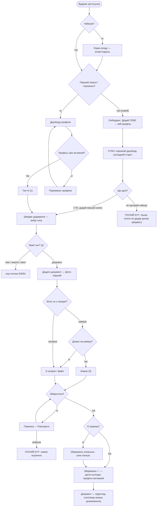
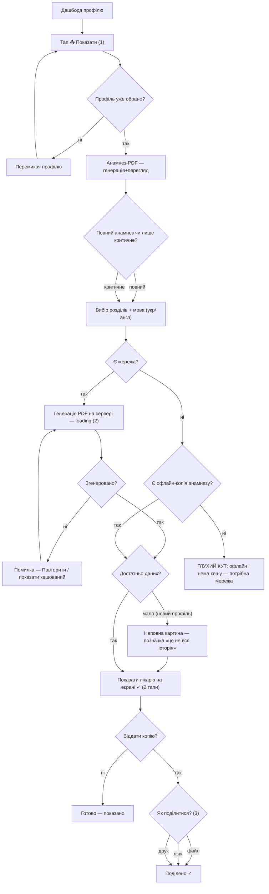
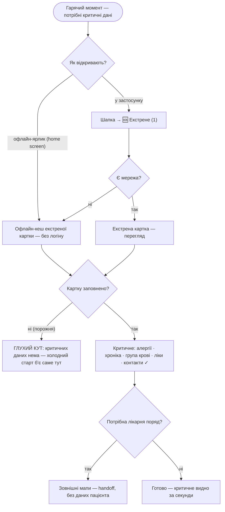

# User flows — Kartka

Наскрізні потоки для **ядра MVP** (jobs із [`research/jtbd.md`](research/jtbd.md)).
Вузли `[у дужках]` — екрани зі [`sitemap.md`](sitemap.md) («Екрани»); ромби
`{питання?}` — точки рішень; стани (холодний старт / офлайн / error) — окремими
вузлами. **Межа:** жоден вузол не інтерпретує дані (норм/зон/оцінок немає — AVOID).

---

## R1 — ДОДАТИ документ  *(ризик №1, ціль ≤3 тапи · primary: Координатор)*

**Рішення:** `Увійшов?` · `Перший запуск/порожньо?` (холодний старт) · `Профіль
уже активний?` (інакше — перемикач) · `Який тип?` (глобальний «+») · `Фото чи з
галереї?` · `Дозвіл на камеру?` · `Збереглося?` · `Є мережа?`.
**Стани:** холодний старт (порожній дашборд + CTA), локальне збереження офлайн
(черга синку), помилка збереження (повтор).
**Щасливий шлях ≤3 тапи:** `➕ (1) → Документ (2) → Знімок (3)` → збережено
(дата/профіль авто, фото-перший комітить одразу).
**Тупики:** новий користувач не зрозумів навіщо → пішов (adoption-ризик);
вийшов під час помилки → знімок втрачено.

---

## R2 — ПОКАЗАТИ анамнез лікарю  *(момент цінності · primary)*

**Рішення:** `Профіль уже обрано?` · `Повний чи лише критичне?` · `Є мережа?`
(офлайн → кеш) · `Згенеровано?` · `Достатньо даних?` · `Як поділитися?`.
**Стани:** loading (серверна генерація), помилка генерації (повтор/кеш), офлайн
(кешований анамнез — jtbd сц.2), неповна картина (чесна позначка, **не** оцінка).
**Щасливий шлях:** `📤 Показати (1) → Згенерувати (2)` → показ на екрані = **2
тапи**; `+ Поділитися (3)` = віддати файл.
**Тупики:** офлайн **і** немає офлайн-копії (ще жодного разу не генерували) →
потрібна мережа.

---

## R5 — ЕКСТРЕНА картка  *(гарячий момент · офлайн обов'язково · використовує Носій/інший)*

**Рішення:** `Як відкривають?` (офлайн-ярлик без логіну vs у застосунку) · `Є
мережа?` (офлайн → кеш) · `Картку заповнено?` · `Потрібна лікарня поряд?`.
**Стани:** **офлайн-кеш** (service worker, без повного входу — CLAUDE §6) —
обов'язкова гілка; порожня картка (холодний старт). Кеш містить картки всіх
членів, тож вибір члена працює офлайн.
**Щасливий шлях:** `🆘 / офлайн-ярлик (1)` → критичне видно за **1 тап**, офлайн.
**Тупики:** базову картку не заповнено → у кризі нема що показати (холодний старт
вражає саме екстрений сценарій — найдорожчий тупик).
**Handoff:** «Лікарня/травмпункт поряд» → зовнішні мапи ОС, без передачі даних
пацієнта (не екран, не каталог).

---

> **Межа дотримана:** жоден вузол не інтерпретує дані — ніяких норм-зон, оцінок чи
> «відхилень» (AVOID, SaMD). Анамнез і екстрена картка лише **показують** факти;
> «неповна картина» — це чесна позначка повноти, не оцінка стану.
