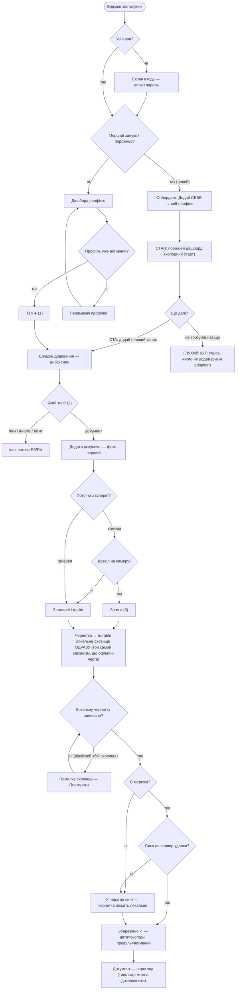
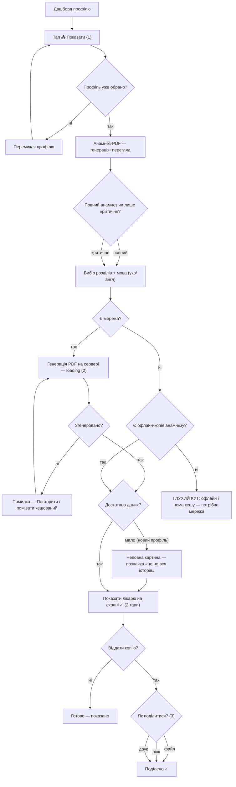
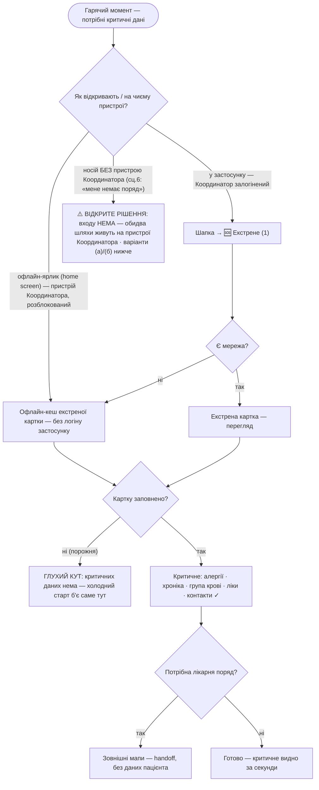

# User flows — Kartka

Наскрізні потоки для **ядра MVP** (jobs із [`research/jtbd.md`](research/jtbd.md)).
Вузли `[у дужках]` — екрани зі [`sitemap.md`](sitemap.md) («Екрани»); ромби
`{питання?}` — точки рішень; стани (холодний старт / офлайн / error) — окремими
вузлами. **Межа:** жоден вузол не інтерпретує дані (норм/зон/оцінок немає — AVOID).

---

## R1 — ДОДАТИ документ  *(ризик №1, ціль ≤3 тапи · primary: Координатор)*

**Рішення:** `Увійшов?` · `Перший запуск/порожньо?` (холодний старт) · `Профіль
уже активний?` (інакше — перемикач) · `Який тип?` (глобальний «+») · `Фото чи з
галереї?` · `Дозвіл на камеру?` · `Локальну чернетку записано?` · `Є мережа?` ·
`Синк удався?`.
**Стани:** холодний старт (порожній дашборд + CTA); **durable-чернетка одразу
після знімка** (той самий механізм, що офлайн-черга) → синк фоном; локальне
збереження офлайн (черга синку); рідкісний збій сховища (повтор).
**Щасливий шлях ≤3 тапи:** `➕ (1) → Документ (2) → Знімок (3)` → збережено
(дата/профіль авто; знімок одразу йде в durable-чернетку, синк — фоном).
**Тупики:** новий користувач не зрозумів навіщо → пішов (adoption-ризик — **досі
відкрито**, IA-борг).
**Закрито (було тупиком):** «вийшов під час помилки → знімок втрачено» більше
**не** тупик — знімок одразу в durable-чернетці, синк-помилка лише відкладає
докоміт у фон; лишається тільки рідкісний збій *локального* сховища (показуємо
помилку, не тиха втрата).

---

## R2 — ПОКАЗАТИ анамнез лікарю  *(момент цінності · primary)*

**Рішення:** `Профіль уже обрано?` · `Повний чи лише критичне?` · `Є мережа?`
(офлайн → кеш) · `Згенеровано?` · `Достатньо даних?` · `Як поділитися?`.
**Стани:** loading (серверна генерація), помилка генерації (повтор/кеш), офлайн
(кешований анамнез — jtbd сц.2), неповна картина (чесна позначка, **не** оцінка).
**Щасливий шлях:** `📤 Показати (1) → Згенерувати (2)` → показ на екрані = **2
тапи**; `+ Поділитися (3)` = віддати файл.
**Тупики:** офлайн **і** немає офлайн-копії (ще жодного разу не генерували) →
потрібна мережа.

---

## R5 — ЕКСТРЕНА картка  *(гарячий момент · офлайн обов'язково · використовує Носій/інший)*

**Рішення:** `Як відкривають / на чиєму пристрої?` (офлайн-ярлик / у застосунку /
**носій без пристрою Координатора → ВІДКРИТЕ РІШЕННЯ**) · `Є мережа?` (офлайн →
кеш) · `Картку заповнено?` · `Потрібна лікарня поряд?`.
**Стани:** **офлайн-кеш** (service worker, без повного входу — CLAUDE §6) —
обов'язкова гілка; порожня картка (холодний старт). Кеш містить картки всіх
членів (потік **вибору члена** в кризі — IA-борг, sitemap).
**Щасливий шлях:** `🆘 / офлайн-ярлик (1)` → критичне видно за **1 тап**, офлайн
(на присутньому розблокованому пристрої Координатора).
**Тупики:** базову картку не заповнено → у кризі нема що показати (холодний старт
вражає саме екстрений сценарій — найдорожчий тупик; вихід — IA-борг).
**Handoff:** «Лікарня/травмпункт поряд» → зовнішні мапи ОС, без передачі даних
пацієнта (не екран, не каталог).

**⚠️ ВІДКРИТЕ РІШЕННЯ (P0 — найважливіша знахідка аудиту, НЕ закрите):** обидва
входи вище (офлайн-ярлик і 🆘 у застосунку) фізично живуть на **пристрої
Координатора** і потребують його **присутнім і розблокованим**. Але сц.6 за
визначенням — «мене немає поряд»: тоді сам **Носій** (дитина / літній) у кризі
**не має жодного входу** в екстрену картку. «Без повного входу» обходить логін
*застосунку*, **не** блокування *пристрою*; PWA на lock-screen недосяжна (CLAUDE
§6). → Обіцянка R5 «готовність без мене» для самого Носія наразі **не виконана**.
Два варіанти (рішення — окреме, продуктове; дубль у CLAUDE §6):
- **(а) Звузити обіцянку R5** до «присутній розблокований пристрій Координатора» —
  чесно прибрати «без мене» для носія. Найдешевше, але здає диференціатор проти
  Apple Medical ID (lock-screen на власному пристрої носія).
- **(б) Офлайн-артефакт носія** — друкований QR / картка алергій **при дитині /
  літньому** (поза застосунком, автономний від пристрою Координатора). Дорожче,
  але закриває справжній сц.6.

---

> **Межа дотримана:** жоден вузол не інтерпретує дані — ніяких норм-зон, оцінок чи
> «відхилень» (AVOID, SaMD). Анамнез і екстрена картка лише **показують** факти;
> «неповна картина» — це чесна позначка повноти, не оцінка стану.
